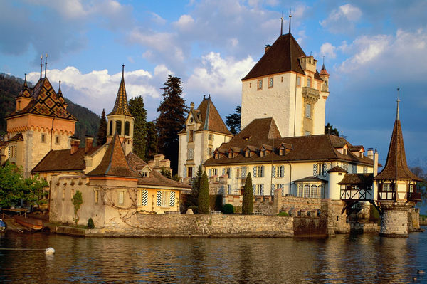

和之前的习惯一样，每篇文章前面会放一张图片。
小博关闭一个多月，最后还是决定重新够买主机将其上线，这样的话，自己便不会偷懒很多，更新频率会比在本地记录有所上升。

这次将博客搬家，做了很大的变动，主机由之前的达拉斯机房换到了韩国的，载入速度上升不少，域名也由 <strong>lattespirit.com.cn</strong> 换成了 <strong>lattespirit.com</strong>,还一次性购买了三年的期限。域名的变换是必然的，使用<strong>.com</strong>的域名会显得更正式，之前也有在推特上表明自己要更换域名的心意，现在已经实现。

关于博客的名称 <strong>Lattespirit</strong> 在这里不多做介绍，可以在博客的<a href="http://www.lattespirit.com/?page_id=26" target="_blank">关于</a>页面里相关的解释。记得一次给人提起域名 <strong>Lattespirit</strong> 时，人家回了句“这么长的域名”，在给网站选取域名的原则上，这个域名确实有些长，还被 longurl 收录过，但这是不介意的，没什么说，爱的就是它。

博客的风格沿用之前的主题，没变。之前有过很长一段时间选择博客的风格，之前的博文中也有记述。博客不关心SEO优化和搜索引擎的收录，折腾之后发现，简单和稳定最幸福。

在这次搬家的过程中，虽只是在电脑面前敲敲键盘，点点鼠标，但确实有如同在现实中搬家的味道。到现在建立博客的初衷还没变，只想单纯地记录自己生活中值得记录的事情或分享自己的心得，希望以后能在博客之路一直走下去。
