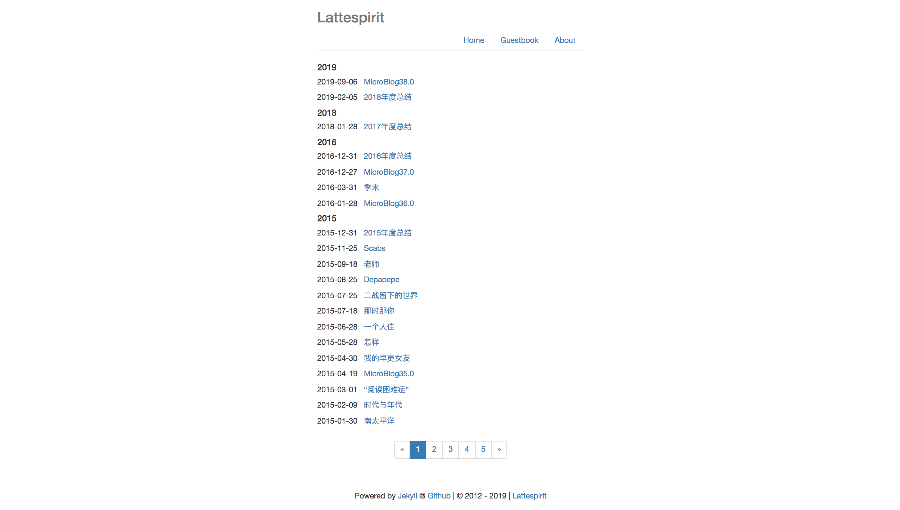

博客迎来了 3.0 版本。

说是版本升级，也只是改变 UI 以及添加了一些页面而已，内容相关的功能几乎没变，在这里简单回顾一下博客 UI 的历程。

###### v1.0

博客上线时用的是别人的 Wordpress 模板，那时 WordPress 非常流行，各种好坏善恶的模板到处都是，我也选了个人气还不错的。开始想在 WebArchive 上找一下 2012-2013 年有没有截取到博客首页的画面，结果发现只有[这个页面](https://web.archive.org/web/20130410015648/http://www.lattespirit.com/)，可惜样式还乱了。最后还是在移动硬盘的备份里找到了一份网站源码，还有数据库，花了点时间搭建好旧版本的 WordPress 后就还原成了下面的模样，且记录为 **1.0**

###### v2.0

接下来就是转入 Github Pages，尝试过在官方推荐的主题中找简约风格的，发现修改起来还略麻烦，就决定自己设计简简单单的页面。Bootstrap 是当时比较热门的，自带响应式天赋属性还有基本的幻灯片，Modal 等组件，很快就把页面设计出来了，因为真的很简洁。

###### v3.0

从 2014 年开始 v2 的 UI 就用到 2019 年底，现在想想，原来已经 5 年了，也该换身新衣裳，加上本身今年个人的方向就是设计，11 月初就开工了。一个多月里业余的时间都用在 Figma 上画设计稿，接下来选择用 <a href="https://tailwindcss.com" target="_blank">TailwindCSS</a> 和 <a href="https://vuejs.org" target="_blank">Vue.js</a> 来实现就比较快了，在开发的过程中，还使用了黑五刚买的 <a href="https://solisapp.com" target="_blank">Solis</a> 进行模拟多设备调试，省下了大量的时间。值得一提的是，这次更新增加了 Typography 页面，展示博客所用到的字体，配色和物料等，入口比较隐蔽，像 <a href="https://laracasts.com" target="_blank">Laracasts</a> 的一样，右键点击 Logo 进入，似乎是不成文的规定，具体还没考究。

###### 需要增加的特性

- 小功能组件化并设计 UI，如块引用，列表等
- 主题化，根据单一位置的配置来切换主题
- 或许会增加 Dark Mode，应该会在下次更换背景时再加，现在已经够 Dark 了 😅

###### 未来计划

添加 Gallery 页面，将以前旅游的见闻以专题的形式展示，效果不会令人失望。

###### 使用博客引擎 Jekyll 遇到的问题

- 为使用 posts.paginator 变量，按照官方文档在 Windows 10 下安装 jekyll-paginate 插件后，变量依然无效，导致我根据 \_site/\*_/_.html 文件 purge CSS 产出时丢失了一些样式类
- jekyll-docker 在 Windows Docker Toolbox 下启动失败，但是估计 Docker Desktop for Windows 正常，没有测试
- 利用 Ngrok 等内网穿透的工具实现真机上打开页面进行测试，0.0.0.0 的默认 URL 无法导致加载样式资源
- 未支持页面热更新

凡此种种，想表达的是 Jekyll 的环境搭建略微复杂，现在静态博客的引擎的选择也非常多，有时间对比一下各自的功能，找到一个开发起来比较友好的，个人觉得有前端背景的引擎会比较适合。
