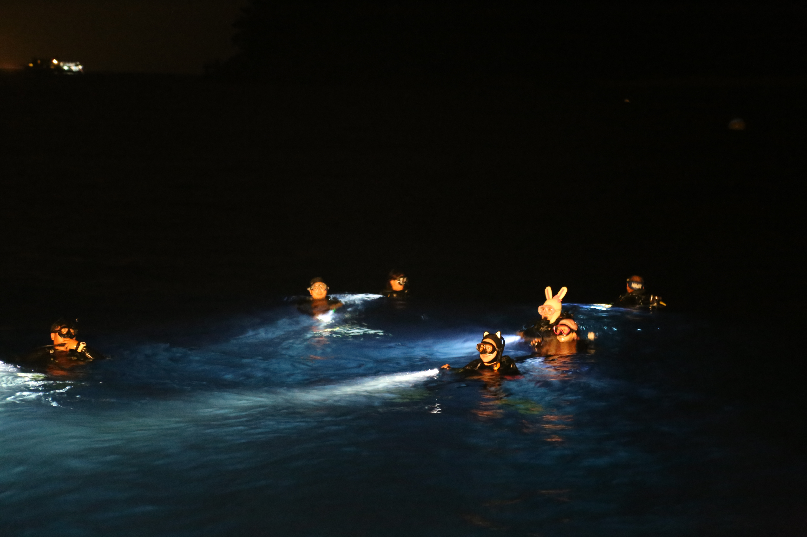
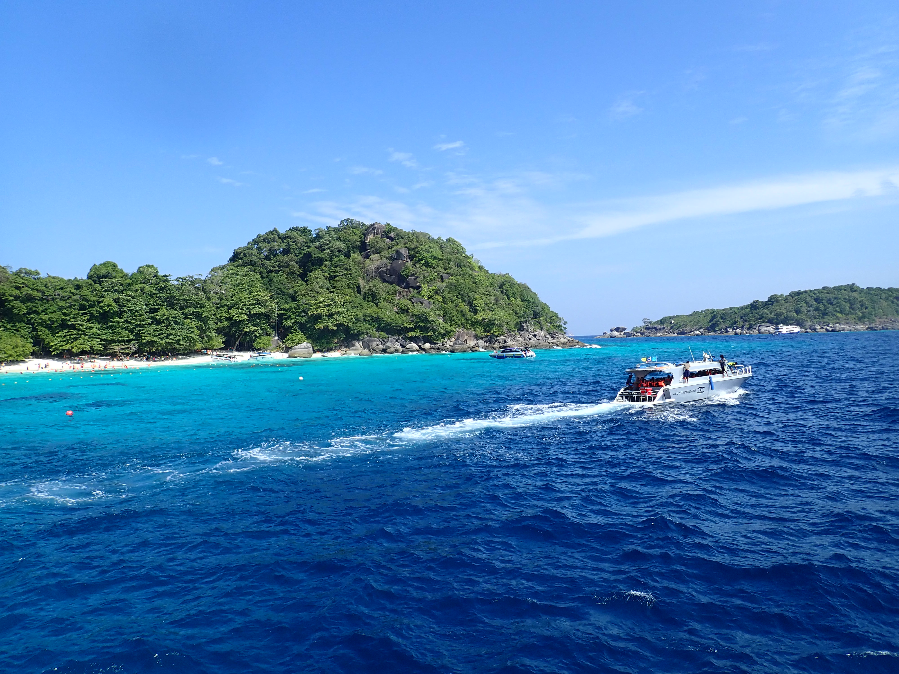

<Carousel>

</Carousel>

回顾一下这两年的下水历程，起初是分别在马来西亚沙巴和塞班军舰岛进行了浮潜，然后到美娜多考证和杜马盖地的初潜，完成了水肺潜水(**Scuba**)资质从初级菜鸟到资深菜鸟的华丽转变。

#### 浮潜

浮潜对于会游泳的人来说是很轻松就能驾驭的，甚至可以连救生衣都不需要。鉴于我浮潜那时候还没学会游泳，只能乖乖地穿上，负责任的潜店也会要求乘客必须穿上。浮潜的地点有两种，一种是大家一起坐船到一个指定的海域，然后就各自穿好救生服下去；另一种是直接在海岸旁浮潜，会有救生员看着，相当于大海版的泳池。

首次下水浮潜还是感到很新奇的，毕竟还没有尝试过和众多叫不出名字的小鱼一起游泳。开始的时候经验比较少，只是自带了面镜、呼吸管以及水下相机就下去了，算是中规中矩的体验潜。第二次在塞班浮潜时，带上了一些面包，在水中握着并时不时挤出少许的面包屑，各路鱼儿就会朝食物扑来，场面颇为壮观，旁边一个韩国妹纸看到还激动地鼓起了掌，直到后来过了两年深潜时船员告诉我们，对于严格保护海洋的海域，这样的做法是被禁止的。

#### 深潜

作为浮潜的进阶成就，深潜是喜欢玩水的玩家要达成的目标。

##### 考证

妹纸心心念念的就是考证然后去深潜呐，在考证前一年买了广州奥林匹克中心泳池的游泳卡，把我从旱鸭子活生生地训练成了在不超过身高的水域无痛游来游去的鸭子，可谓功不可没，毕竟深潜有一个重要的要求是有潜伴互相配合。

现在市面上存在的两大水肺潜水认证机构分别是 [PADI](https://www.padi.com) 和 [NAUI](https://www.naui.org)，等级分很多，最基本的是 **OW**(Open Water Driver) 和 **AOW**(Advanced Open Water Driver)，这也是大多数人会选择的级别，当然，需要先成为 OW 才能继续升级 AOW，一般称为**升 A**，有些海域只允许 AOW 及以上的等级下潜。值得一提的是，无论是哪个机构的 OW，都能在另一个机构中升 A，事实上我们就是从 NAUI 升 A 到 PADI。如果要说在这两个机构中如何选择的话，根据我实际中的体验，PADI 的教学资料更为用心(相比于 NAUI 书本众多的错别字)，市面上见到的机构更多，但最重要的还是遇到的教练教学是否到位，我们接触到的都很负责。

##### 教学内容

**装备拆装**，气瓶，备用气源，仪表，浮力调整器(像背心一样穿在身上，可调整浮力大小，一般叫做 **BCD**)等的拆装是基本的技能，最好还有潜伴互相配合及检查，因为以后去到潜店出海潜水前，大多都是在船上自行拆装，还挺重的。

**基本手势**，在水下的交流都是通过手势，下水练习前会进行教学。

**耳压平衡**，保证耳朵内外压力平衡，这是一项必备的技能，可以在不断下潜的过程中，保护耳朵防止其剧烈疼痛。

**镜面排水**，顾名思义，在水中把面镜摘掉，重新戴上并把水排出。

**中性浮力**，通过调节 BCD 和呼吸使身体保持水平，很难操作的一项，需要不断练习。

**基本救援**，用备用呼吸嘴给受困人员共享氧气等。

 第一次教学会先在一个两三米深的泳池里进行，熟悉一下装备，接着就是去开放水域继续教学和考试，考试的内容和教的一样，有些技能还现教现考，像在水下把 BCD 脱下然后重新穿上，都是很实用且保命的技能，对我之后去其他潜点深潜有及其大的帮助。AOW 的考试内容则有多项考试供选择，水底导航，顶尖中性浮力，鱼类识别，夜潜，沉船潜等。

不管是考 OW 还是升 A，都是有笔试的，前者还比较正式，给学员们一个小时的时间来答题，后者就可以用空闲时间填上自己理解的答案即可。总的来说，能正常完成潜水任务都能过，笔试属于走流程那种，不过还都见过 OW 和 AOW 没过的，OW 没过的原因是该学员真的是怕水，在泳池中摘掉面镜就害怕到马上上浮； AOW 没过的原因说来话长，有些奇葩，是一对男女，大家一起下水后，男的竟然认错教练莫名奇妙游去其他队伍里，女的则是那种跳下水前还会把身上的气瓶敲到船板的人，在海里自己操作错误还怪教练缺乏对她的指导，还吵了起来。

如果时间充裕的话，可以选择 OW 和 AOW 一起过了，一般需要五天左右，有不少人是这么干的。

##### 一些贴士

去过东南亚几个国家浮潜和深潜也有 30+ 次的潜水记录了，已经踩过不少坑，总结了一些经验。

**岸边浮潜穿浮潜鞋**，因为很容易碰到珊瑚或者礁石，脚和膝盖很容易刮伤

**自带防雾剂**，船上有可能会配备类似洗洁精的液体来防雾，个别教练会带，但还是拥有一份比较好

**自带吸嘴**，条件允许的话可以考虑，因为船上的设备是公用的，包括吸嘴，有人可能在海里呕吐过，没错，是海里

**自带潜水帽/服**，带上有特征的潜水帽会给拍照增色不少；船上会提供潜水服，有些甚至比我们自己带的还要暖，去到水下 20+ 米时，有的水域真的很冷了

**先买好潜水日志**，深潜完之后可以要求潜店在潜水日志盖上章，填上水域名，氧气剩余量，最大潜水深度等数据，类似集邮的操作，在潜店买会比外面贵不少

**选择经验丰富的队友**，水性因人而异，我是在水下被别人踢过 N 次，头被别人气瓶撞过 M 次

**检查 BCD 里是否有多的配重**，每个人体重不同，需要在腰上佩戴数量不等的石块来保持浮力稳定，有些人腰上配满了会往 BCD 里加，所以一定要检查 BCD 有没有多的配重，妹纸就因为装备过重在水中一直下沉，所幸有惊无险！

##### 回想

潜水是件有趣的事情，起初我是比较担心和抗拒的，和自己水性不好有关，在妹纸的带领下，屈服在了真香定律，进入到了一个崭新的世界，在水下我们真的看到了[尼莫](https://zh.wikipedia.org/wiki/%E6%B5%B7%E5%BA%95%E6%80%BB%E5%8A%A8%E5%91%98)和[多莉](https://zh.wikipedia.org/wiki/%E6%B5%B7%E5%BA%95%E6%80%BB%E5%8A%A8%E5%91%982%EF%BC%9A%E5%A4%9A%E8%8E%89%E5%8E%BB%E5%93%AA%E5%84%BF)。仍然记得第一次在开放水域跳下水时，除了气泡声和呼吸声，周围死一般的安静，在电视上看了无数次的场景现如今也体验到了。

各个潜点能看到的风景都不一样，也有天气和水质的运气成分，水下能拍照的景物一般有珊瑚和海龟，主角一般是藏在珊瑚中的各种鱼类和海兔，有些潜点还有鱼群形成的令人叹为观止的杰克风暴。拍照的时候，电筒少不了，潜到下面 20 多米的地方，光线不会很充足，灯光成为拍摄大片至关重要的因素，否则经常会在水下拍出红绿水鬼照。比较有意思的潜点，像在菲律宾的杜马盖地，还能和鲸鲨一起游玩，一个庞然大物从身边游过的感觉还是很奇妙的，之前只在珠海长隆的水族馆里看到过。

个人还比较推荐体验一下船宿，普通的潜店都是载着一批游客到指定地点潜完后当天就回来，船宿的话则是在一个岛屿旁停下来过夜，晚上还能进行夜潜。我们去的是斯米兰岛，那天我有些感冒鼻子有点塞，白天下水时耳压平衡还花了不少时间，考虑到安全，就没有去，只能在船上拍拍照。据潜伴说夜潜看到的大多数一些小虫子，和电视上的画面有不少差距。船宿还有一个好处就是避开大量游客，早上我们起来的时候让船家开个小艇把我们几个人送到岛上浮潜，有将一个岛承包的感觉哈哈。

其中认识很多潜友，一个独自一人来学潜水的小哥哥，他说去过很多地方都是自己一个人；佛系小姐姐和她老公一起来，用行李箱带上自己的潜水装备，自己一个人带着电筒和叮叮棒，娴熟地在水中只是看看；重庆一对年轻教师来潜水前，还在水族馆里练习了很久，中性浮力练得已经如火纯青。

常常听到说 XX 深似海，潜水是**真**深似海，只要出海，一切以安全为主，时刻要保护好自己，最好要在潜导或者潜伴陪同下进行。
