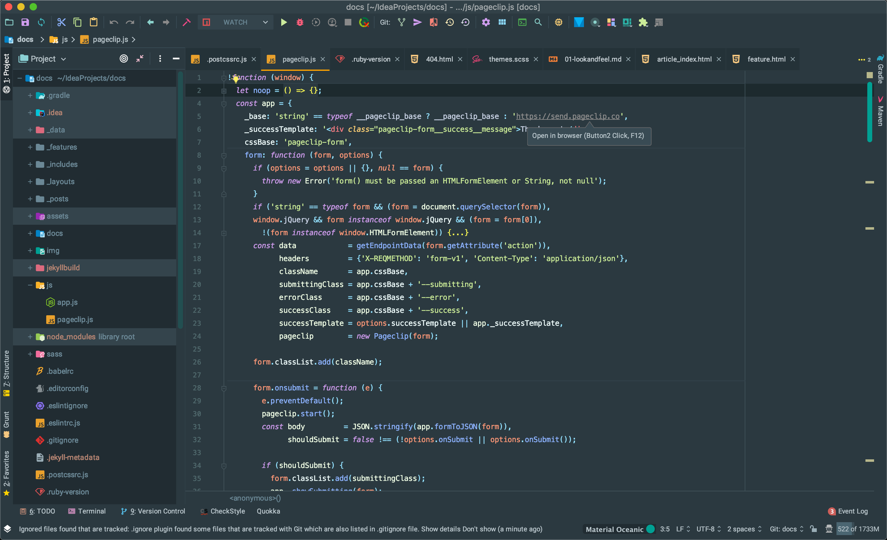
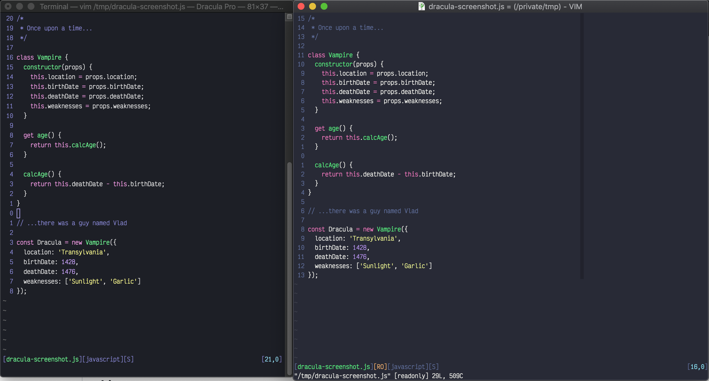
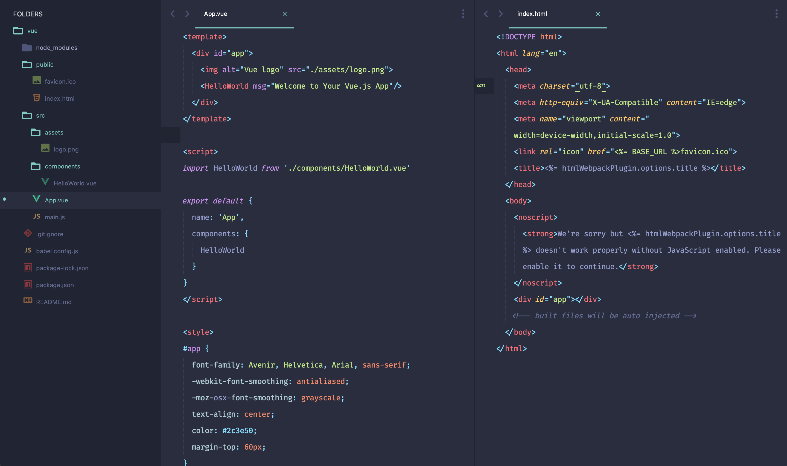
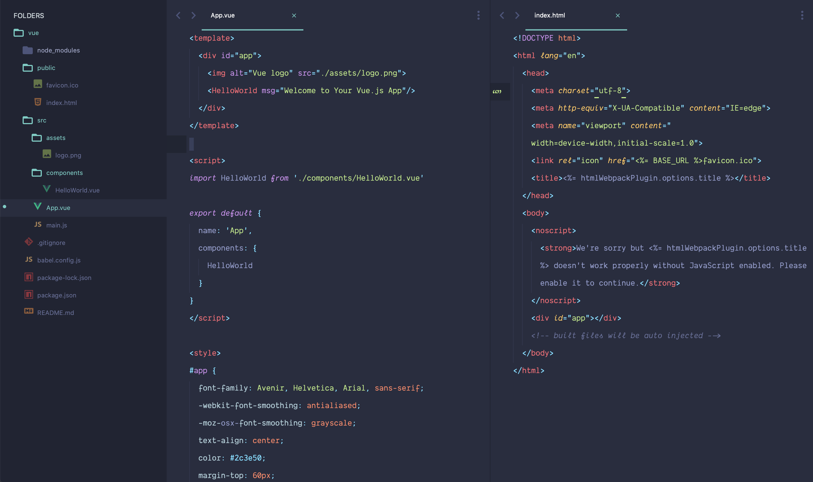
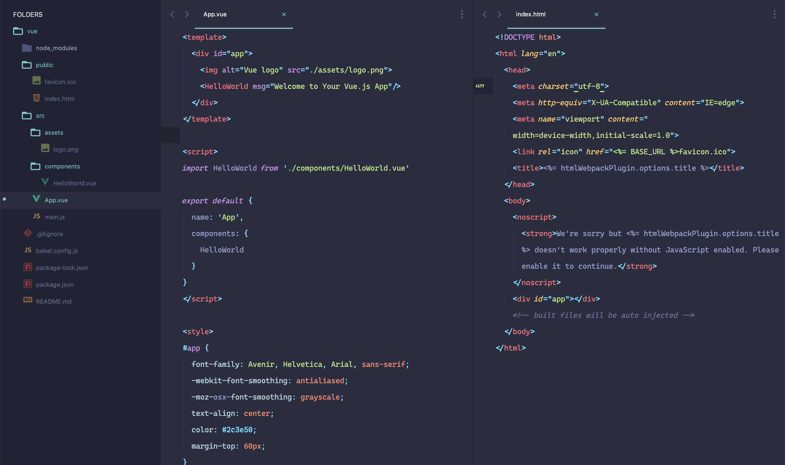

#### 前言

从这篇文章开始，准备写一个系列，总结我(假装很)多年来使用编辑器 / IDE 后，觉得在写代码的过程中能提升效率的工作流，所介绍的工作流并不局限于某个编辑器或者 IDE，之后的文章里也统称**编辑器**。顺便解释一下**基操勿 6**是“**基本操作勿扣 666**”的意思。

先从最简单的 UI 开始，令人赏心悦目的 UI 能让眼睛不至于疲惫。不管是编辑器还是 IDE，都能以插件或者扩展的形式对外观进行修改，并且能设置字体，以下是当前流行的主题外观和字体。

#### 主题

 

##### [Material Theme](https://www.material-theme.com/)👇

群众基础很大的一款主题，提供了 Oceanic, Palenight, Darker, Lighter 的配色，还包含了文件的 icon。

##### [Dracula Theme](https://draculatheme.com/)👇

吸血鬼的主题，支持的 app 很广泛。

##### [Rainglow](https://rainglow.io/)👇

提供了丰富的 Color Scheme。

##### [Monokai Pro](https://monokai.pro/)👇

据官网介绍，该配色经过精心的设计，让用户更专注于正在写的内容，但只提供了 Sublime Text 和 VS Code 的版本。

##### [Nord Theme](https://www.nordtheme.com/)👇

一套配色方案，在各编辑器、IDE、终端上有各自的实现。

#### 字体

 

##### [Fira Code](https://github.com/tonsky/FiraCode)👇

一款开源的等宽字体，支持 ligature.

##### [Operator Mono](https://www.typography.com/fonts/operator/overview)👇

很有特色的一款字体，看起来很舒服，价格不菲。

##### [Dank Mono](https://dank.sh/)👇

同样适合码字，字母 **f** 的设计让人印象深刻，价值 40.00£.

##### [Cascadia Code](https://github.com/microsoft/cascadia-code)👇

微软开源的字体，属于耐看类型。

**注**：本博客的图片目前缺少 lightbox 功能(即点击图片可放大)，可能导致上面图片中字体看起来不是很明显，lightbox 功能已加入 TODO List，不久就会上线。

下一篇将会聊到**光标**。
