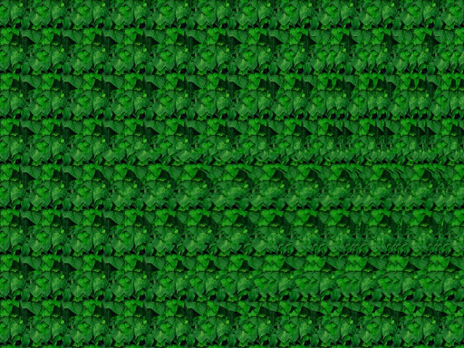
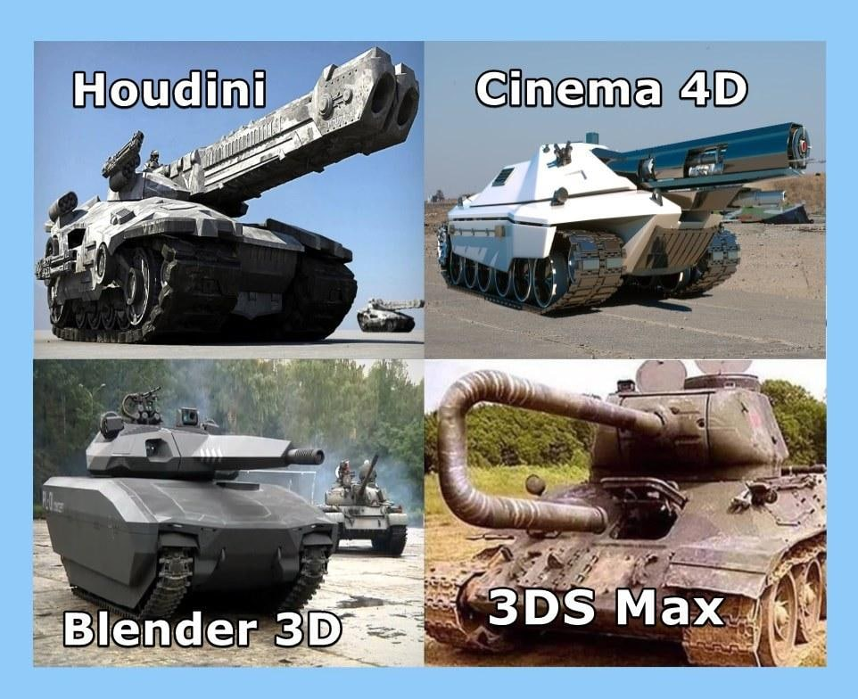

3D 这个概念可以说已经普及大众了，像 3D 电影，VR 游戏，甚至全息 3D 的广告或者公共提示，都能看到它的踪迹。记得最初接触 3D 是在高中，看到同学拿出一本印刷有各种隐藏着 3D 效果图片的书，需要调节眼睛才能看到效果，如下图所示，我的方法是，眼睛先对焦绿色的图片，然后调节眼睛的对焦，使图片外的区域变得略模糊，顺利的话，能在绿色的背景下看到**蝴蝶**的 3D 图像。

#### 入坑开始

以前对 3D 的理解仅限于“**这个效果给人感觉很立体**”，去年看过[Maxon Cinema 4D Demo Reel 2019](https://www.youtube.com/watch?v=hDMMw06ES-A)这个视频后，仿佛进入了一个新的世界，原来 3D 软件能创造出这么酷炫的视觉效果，视频由很多个作品组成，每个作品也就几秒钟，但都足以细细品味，其背景音乐也功不可没。于是决定尝试入一下坑，对 3D 软件的认知还停留在 3ds Max，还是家里书架存放已久的未知来源书籍《3ds Max 效果图设计自学经典》 😅，搜寻了一下 3D 软件界的资料，发现 Cinema 4D 和 Blender 比较适合。

[Cinema 4D](https://www.maxon.net/en/cinema-4d) 是闭源收费软件，价格不菲，看到的大部分作品都非常精美，据说界面设计比较容易上手；[Blender](https://www.blender.org) 是开源免费软件，GPL 协议让用户有足够的自由来使用，社区也很强大。起初对于 Cinema 4D 之于 Blender 的看法，相当于 P 图界中 **Photoshop** 之于 **GIMP**，由于感觉 GIMP 比较冷门，使用人群不多，一开始还担心 Blender 的也是这样，接触了一段时间后发现社区，资源，插件等还是很不错的。

总的来说，两者都适合入门和进阶，但考虑到价格与版权（看过群友讨论 Cinema 4D 东家告了一些使用盗版的公司），最终屈服在真香定律选择了 Blender。当然了，还有其他优秀的软件，像 [SideFx](https://www.sidefx.com)公司 的 [Houdini](https://www.sidefx.com/products/houdini/)，用它制作出来的[电影特效](https://vimeo.com/441339532)和[游戏效果](https://vimeo.com/397201248)非常震撼，就不一一列举了。网上还有一些关于这些软件的评价表情包，如下图，仅供娱乐的同时也道出了一些事实。

#### Blender 实战路线

一开始看的是 Blender 官方的[基础教程](https://www.youtube.com/playlist?list=PLa1F2ddGya_-UvuAqHAksYnB0qL9yWDO6)，了解基本的界面和操作，接下来看[Blender Guru](https://www.youtube.com/channel/UCOKHwx1VCdgnxwbjyb9Iu1g)一步步实现[甜甜圈](https://www.youtube.com/playlist?list=PLjEaoINr3zgH1JI7FtPX_Q9OGFhP-HCUV)的制作，最近则是跟着[CGBoost](https://cgboost.com/)的[课程](https://cgboost.com/blender-launchpad/)实战汽车模型的制作以及动画的基本实现。

这些流程走下来，可以说是成功入坑了。

#### Web 端

Web 端上让人引起舒适的 3D 效果除了[Three.js 官网](https://threejs.org)的例子外，还有模型的导入，让我心心念念的例子有[playdate 官网](https://play.date)首页的游戏机模型，以及[Sketchfab 官网](https://sketchfab.com)首页 Sci-fi 风格的昆虫(目前变成了一只鞋子)。既然现在已经有建好的汽车模型，折腾一下展示在这里也是十分必要的，最终效果**如下所示**

<Car />

在 Web 端上通过 React 实现展示这样的模型花了不少功夫，障碍在于对 Three.js 掌握不够深入，还有相关扩展包的文档不够详细，不过能有这样的效果还算满意。

#### 还有

3D 还有很多应用的领域没接触到，像视频特效，VR/AR， Web/APP 游戏，这些领域都很有趣且具备挑战性。值得一提的还有 3D 打印，看过别人用 Blender 建模，然后通过 Snapmaker 打印出一些简单的生活小工具，花费的人力物力还不小，纯属观望一下。
