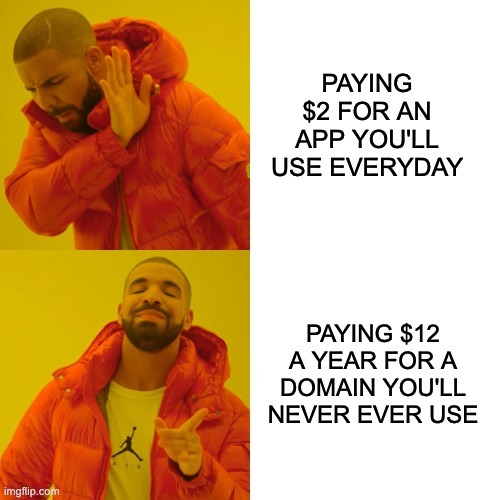
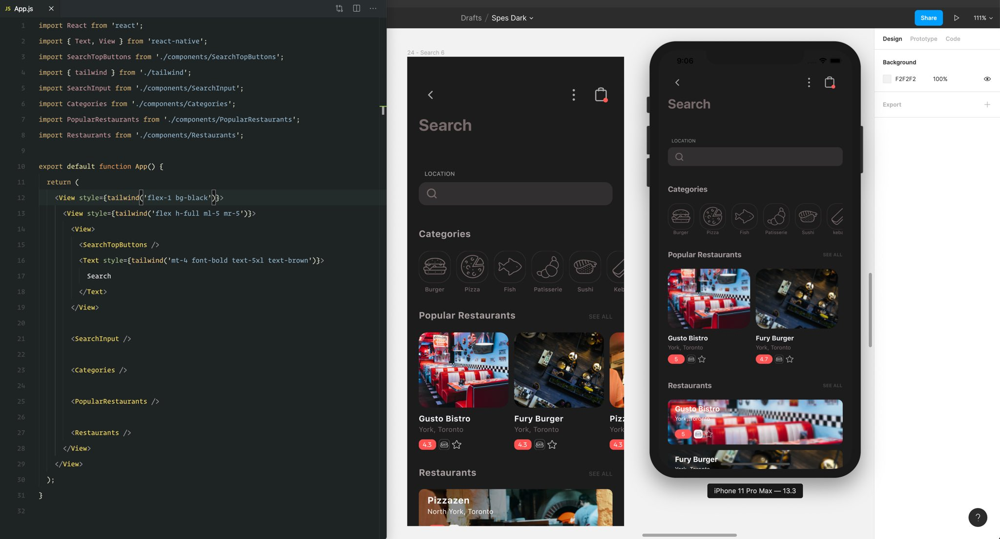
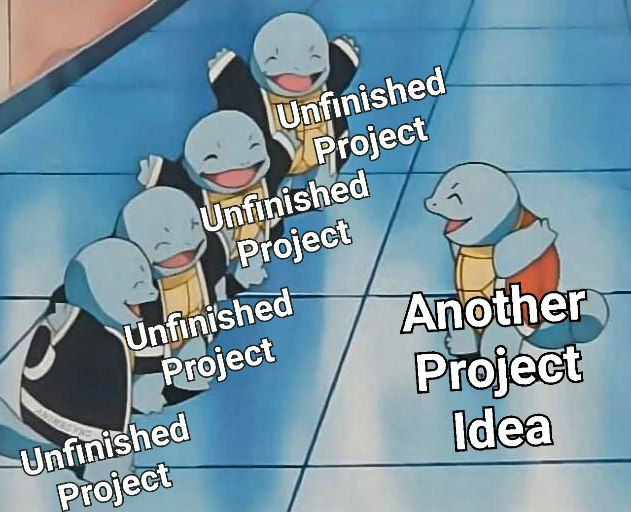

这篇年度总结确实是有点晚了，草稿是 **2021-01-17** 的，现在才补充完，与所谓的“手感”相关吧，不是为了完成任务而记录。不过想到自己那么久没发文，不自觉地想到下图。

#### 探索

这年可以称为**探索**的一年，年初的时候看了很多后端技术外的入门资料，像重构博客时尝试的 React，以及 [Raywenderlich](https://www.raywenderlich.com/) 家 Swift 与 Kotlin 相关的书，可以说只是浅尝辄止。

关于 React Native 和 Flutter，也看了一些对两者比较的文章，几乎都说 Flutter 性能好，未来发展好，全平台支持只是时间问题，如今 Flutter 2 发布了，也确实如此。对于 Web 端开发者来说，React Native 则非常容易上手，各有各的优势。为了都体验一下两者的开发流程，我还特意在 [UI8](https://ui8.net/) 选了一套 APP 原型，打算用两者都实现一下，先从 React Native 开始，大概完成一半 UI 后，因动力不足就停止了，下图是开发部分 UI 的过程。对于 Flutter，则是浏览过几遍官网的 Cookbook 部分，也发现 [Flutter Complete Reference](https://fluttercompletereference.com/) 这本书挺好，知识点覆盖广，也很详细，值得一看。

#### 小程序与产品

这年计划开始学习日语，在这过程中发现使用日语输入法打字是不可或缺的环节，由此萌生了开发一个**练习日语打字**微信小程序的想法，满足以下功能:

- 屏幕显示一个日语单词，用键盘输入正确的罗马音或者平/片假名就能跳转至下一个单词

- 提供按钮来显示和隐藏答案

- 提供按钮跳过当前单词

原型很快就用 Figma 画完了，附上[地址](https://www.figma.com/file/k7KJ2sxnx9JBm4gAkBxlQx/Japanese-Typewriting)，调研一下现在开发小程序流行的框架后，用一个礼拜的业余时间完成了功能，提交后过一天就上线了，二维码就不贴了，在微信中搜索【**日语打字机**】能找到。接下来发现加载背景图较慢，而且还不允许使用包内的图片，最后暂定用渐变颜色代替。

这个小程序算是一个很小的产品，由于日语知识有限，甚至里面的单词都是在网上找的，没有一一确认过是否正确，很多功能都没有实现，比如播放日语歌曲，同时练习输入歌词中的句子，甚至还可以显示歌词中的文法。这些专业知识的局限性让我也开始思考在选择独立开发一个产品前，idea 足够适合大众的同时，也需要拥有该领域丰富的知识储备，或者学习曲线够平滑，这样才能保证项目的进行，否则得需要专业人士的介入。

对比这个小程序与上述 React Native 未完成的练手项目，还有一个**重要的体会**是，开发过程一定要快，不然激情会慢慢消磨掉，结果就变成下图。

#### 日语

这一年也计划重新开始学习日语，过了五十音这关后，开始学一些简单的文法时感觉还不错，后来看到动词的 N 种变化类型时，感到记不下来，心态没调整好，就停滞了很长一段时间。成就感在我学习的过程中扮演着一个重要的角色，不足时会调整方向。

#### 离职

这年离职了，认识了一些有趣的小伙伴，和香港同事一起工作过，部分同事打字喜欢用英文，讲话则用粤语，有时开会则普通话与粤语混用，也是不错的体验呢。

由于团队开始前期的工作环境是联合办公的，我也有机会体验了[BEEPLUS](https://www.beeplus.com/)这种新办公生态环境，布局清新优雅，提供饮料咖啡，办公桌上班的心情好了不少。

2018 年圣诞节，团队还有幸被邀请至香港参加 Party，香港同事和老大们都非常热情，老大们毫无架子，非常接地气，这都是难忘的回忆。

#### 健身

早在 19 年底就有办健身卡，开始去的次数并不多，也没有任何饮食计划，而且 2020 年新冠肆虐期间，有大半年的时间健身馆都处于闭馆状态，直到 20 年 9 月份才开馆。

这年胖了很多，曾有两个月的上班时间里，中午烧腊饭过后不是一杯喜茶就是奈雪，偶尔还跟着小伙伴点下午茶，体重一度直逼 70 kg。有一次称重，上面显示 **69.5** kg 时，望着肚腩，突然很嫌弃自己，觉得不能这样下去。以前也有经常锻炼，那也是大学之前的事情了，工作后大家普遍“发福”，能保持身材的屈指可数，自己也踏入中年队列，为了在以后的同学聚会上不至于显得老态，显老三大件“**秃头**，**肥胖**，**肤色差**”要控制住。

**锻炼+控制饮食**一开始很难适应，不仅是食物种类和味道上的变化，前期锻炼时也比较盲目，每天盯着体重，有时候没降低反而上升就容易感到气馁。

锻炼上选择了自己来，在网上看看别人的教程，然后实践。一开始做大量的有氧，跑步，动感单车，掉的都是水分，但也唤醒了身体。一个月的有氧后，开始进行力量训练。自以为按照器械上面的图示就能锻炼到相应的部位，实践后才发现姿势和动作是相当重要，稍有偏差就不能刺激到目标部位，效果会大打折扣。最近在尝试来自 [Pete](https://www.instagram.com/pete619muscle/) 的“**普罗米修斯**”法则来增肌，期待未来一段日子里身体的变化。

饮食上减少脂肪和碳水的摄入，有一段时间中午吃的是自己做的三明治，晚饭吃代餐粉。健身路上总会有些拦路虎，有时候也去聚个餐之类的。离职后时间更多了，中午经常吃玉米和番薯，锻炼回来后喝牛奶和鸡蛋补充蛋白。坚持四个月后的体重，虽然有起有落，但也降到了 **60kg**。

健身是漫长的过程，包括会长期出现在以后的生活中。这次健身的体验不仅让我完成了“**和妹子一起变胖也一起变瘦**”这个基本计划，还有唤醒了控制饮食和保持运动意识，在和健身房教练的交流中，发现了自己有富贵包，脊柱侧弯，大小胸，长短腿等问题，改善这些问题是一个长期的过程，也警示着自己注意生活中的一些小习惯。

#### 3D

阅读过上一篇文章的朋友们可以知道，3D 也是这年一个重要的主题。选择了 **Blender** 之后，在网上搜集了大量的视频资料，准备深度学习一番。但发现要学的东西太多了，Blender 是一个神奇的软件，能胜任的工作很多很多，3D 建模(Modeling)，绑定(Rigging)，视频编辑(Video Editing)，雕刻(Sculpting)等等，学完是不现实的，也完全没必要。自己的目标是做一些特效视频，所以选择了几个主题，**Modeling** 是基础，必须的，还有 **Video Editing** 以及 **Motion Tracking**，这几样够学一段时间了。

关于视频编辑和特效制作使用的软件，开始选择的是 Adobe 家的 PR 和 AE，甚至还找到别人如何下载官网正版安装包的[脚本](https://gist.github.com/ayyybe/a5f01c6f40020f9a7bc4939beeb2df1d)，还有使用 [Adobe Zii](https://www.adobezii.com/)进行破解的流程。安装完之后不是很想用盗版，Adobe 年计划订阅又偏贵，以后有能力了再购买一次性付款的同类软件，如[达芬奇](https://www.blackmagicdesign.com/products/davinciresolve/)，似乎免费版的功能也很香了，目前处于入门阶段就不作太多评价了。

二一年，祝大家**身体健康**。
