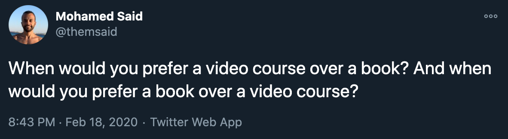

平时生活中总会有这样或那样的问题需要解决，有时也会拓展自己的兴趣去学绘画，修车，财务管理等，自身技能树因此要不断扩展。当学习一项新技能时，什么样的学习途径才是适合自己？

早在去年年初在网上就看见过这样的[讨论](https://twitter.com/themsaid/status/1229748343464759296)：

最近看到阮一峰的一篇文章[视频学习胜过读书吗?](https://www.ruanyifeng.com/blog/2021/07/weekly-issue-166.html)也有提及。

意思是学习时，什么时候选择视频，什么时候选择书籍？看到这个讨论时，我仔细回顾了一下，在、过去新知识的获取途径中，书籍和视频占据了极大部分比重，剩下的包括“和别人沟通”，“主动查阅感兴趣的百科条目”，“偶然被动的宣传”等。

既然视频和书籍的占比这么大，那么怎样选择才能更大地提升学习的效率呢？根据实际的经验，总结出个人的选择，对于**理论类**，如编程技能，选择视频对整体内容有个大概的了解，然后阅读相关书本深入理解；对于**视觉类**，如烹饪，绘画，建模等技能，选择视频。

不管是书籍还是视频，都在考验作者的表达能力，每看一本新书或者视频课程，都要接受新的教学方式。书籍还好，内容结构大部分都一样，一般先是前言，然后是一些注意事项，接着是正式内容，最后是附录，打开一本新书基本都能看得下去。视频就不太一样了，教学形式多种多样，有以下情形的我基本很少看：

- **网课**，这样的形式动不动就一两个小时，中间很多垃圾时间，提取知识点耗时太长。最近看到非常感兴趣的话题[Building A Second Brain](https://www.buildingasecondbrain.com)，由于也是网课，结果看不下去
- **屏幕不动，人一直在讲话**，主要还是看讲话内容的含金量，不然跟听播客差不多
- **边讲边写下自己的话**，这不是逼人按快进么

抛弃了很多课程后，作为一个知识接收者，我开始思考，书籍和视频要以什么的教学形式，能有条理地解释清楚知识内容且能让大多数人接受。在总结之前，我回想了一下看过的课程中有哪些是印象深刻的，想到的有 [Test-Driven Laravel](https://course.testdrivenlaravel.com) 和 [Blender Launch Pad](https://academy.cgboost.com/p/blender-2-8-launch-pad)，前者让我对 TDD 从陌生到熟悉，后者让我系统地走了一遍 Blender 建模的流程，到现在都没有对里面的内容感到模糊。由这两个课程的教学方式出发，总结出以下个人觉得一个好的课程该有的特征：

- **先整体介绍和展示成果**，让读者能以上帝视角，了解章节或者整个课程的脉络
- **知识点解释要足够简洁**，按照“是什么，怎样做，为什么这样做(即使用场景)”的套路一般能够解释清楚
- **将知识点用在项目或者例子上**，可以理解为 **Learn By Doing/Example**，一个章节或者整个课程都可以作为一个项目，章节也可以作为整个项目的铺垫，比如 Blender Launch Pad，课程从零开始，结束后能渲染出一个视频

以上是个人关于选择书籍还是视频的想法，**不是建议**，找到自己的学习新技能的方式最佳。 接下来的一篇文章，我会尝试使用上述教学方式介绍一种电影中常用的人像照明方式 [Rembrandt lighting](https://en.wikipedia.org/wiki/Rembrandt_lighting)
