最近看了 [Stand Out as a Web Designer](https://designfulltime.com) 这个课程，讲述的是设计网页的一些建议，课程由八节课组成，每个节课讲述一个建议，在这里做一些总结。

#### Power of the Main Lockup

**Main Lockup** 指的是网页中的一个板块，能让访客迅速了解品牌网站的基本信息、方向或者主题，还能做相应的引导，因此这个板块应该摆放在首页最显眼的位置。一般由以下三部分组成：

- Main Headline 主标题
- Sub Headline 子标题
- CTA(Call To Action) 召唤行动

很多大型网站的首页都体现了这样的设计，如 [Webflow](https://webflow.com/)，[Stripe](https://stripe.com/)，[GitHub](https://github.com/)，[Sketch](https://www.sketch.com/) 等等这些耳熟能详的网站。

再举一个小众的网站，在看课程前我也没听过的，[Casa Home](https://www.hellocasahome.com/)，如下图红框所示，一浏览首页就能快速了解网站是卖蜡烛香薰的，Main Headline 最显眼和简短，Sub Headline 作了详细的补充，而且 **Shop Now** 这个 Call To Action 按钮包含了设计者引导并期望用户跳转至商品页面进行浏览的意图。

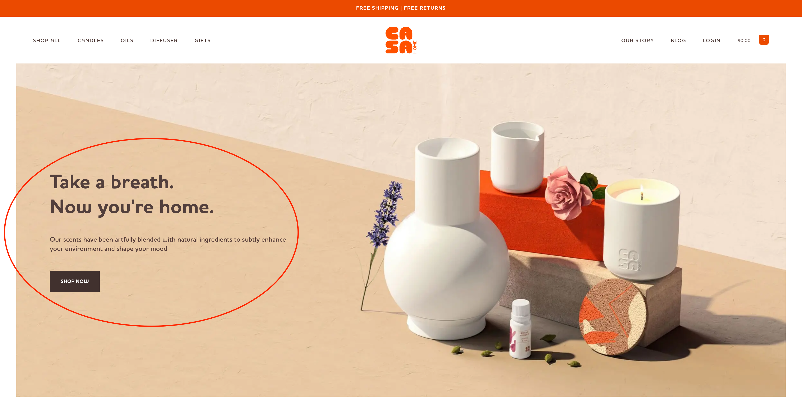

#### Importance of One Main CTA

每个网站都有自己 CTA 的展现方式，数量也不尽相同，建议是 CTA 数量尽可能少，展示核心的即可。

CTA 展示问题常见的有：

- 文案、引导功能相同的 CTA 出现在多处，使得冗余元素太多
- 文案不同，引导功能相同的 CTA 出现在多处，让人不知道选哪个
- CTA 太多

下面三个例子能很好地说明问题

Sketch 将两个注册功能相同的按钮放在了不同的地方，而且都很突出

Webflow 的两个按钮也都是注册功能，文案和背景稍有不同

Slack 的包含太多 CTA，页面显得复杂和臃肿

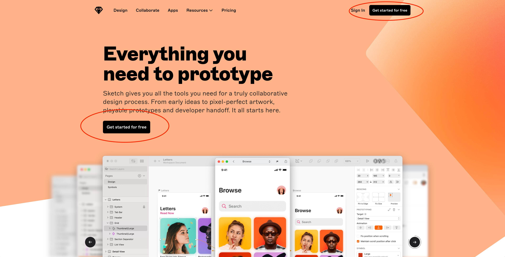
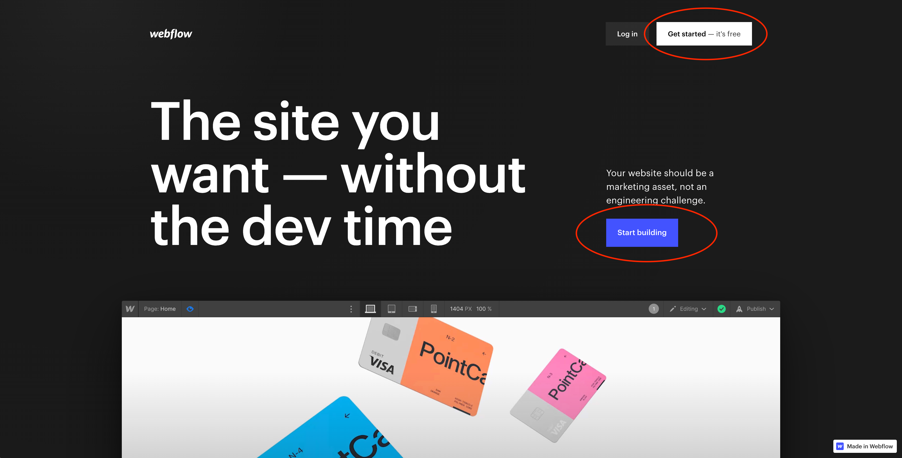
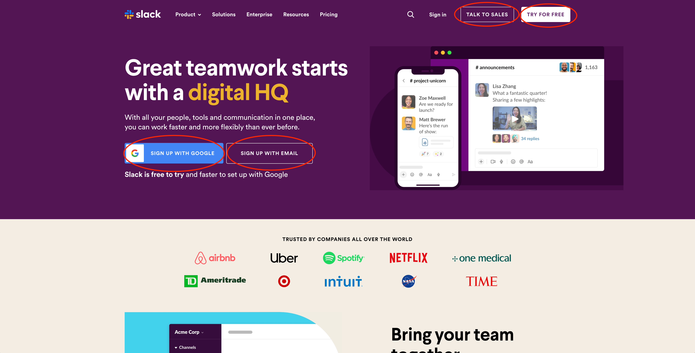

Stripe 就很好地突出了一个他们认为最重要的注册 CTA，其他 CTA 如 "Sign In" 和 "Contact sales" 相较于注册的则没有“抢占风头”

总的来说，CTA 要尽可能地少，多个 CTA 存在时，需要保证它们不会互相竞争来吸人眼球，而且要将最希望访客进行下一步操作的 CTA 凸显出来

#### How to Tease Continuation

**Tease Continuation** 的翻译让人有点犯难，直译也不会达到让人马上明白的效果，就先举个例子。

一般来说，网页的所有内容不能一次性在屏幕中全部展示出来，需要上下或者左右滚动进行浏览，巧妙地通过网页元素的摆放，隐式地，而不是通过跳动的箭头或者文字显式告诉访客进行滚动，则称为 Tease Continuation，达到了 **Say it without saying it** 的效果。

通过下面 [Vimeo](https://vimeo.com/) 和 [Around](https://www.around.co/) 官网首页的底部就能很好地说明

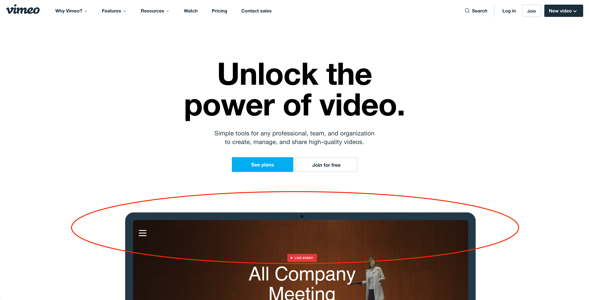
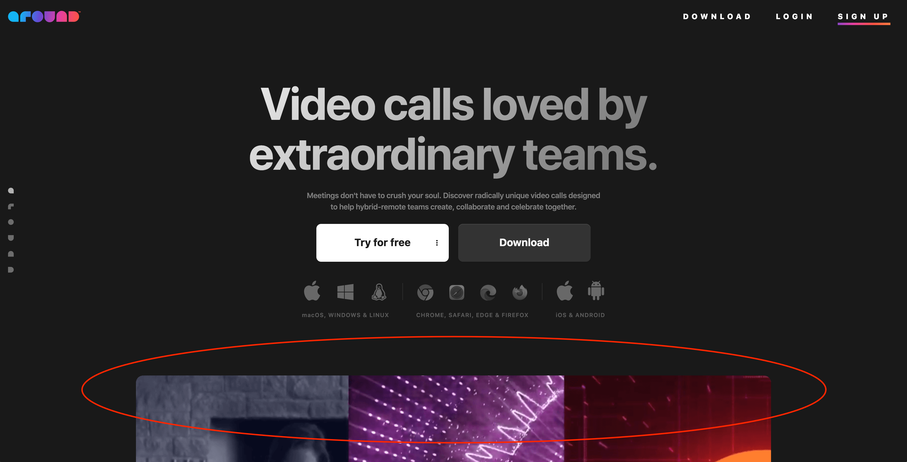

此外还提到了好的网站设计三大要素

- Good Typography
- Good CTA
- Tease Continuation

#### Clean Simple Lines

网页的元素，如 Logo，标题，图片，文字段落等尽量保持在一条直线上，看起来就很干净整洁。

正常在做设计稿的时候，一般都先根据目标屏幕的尺寸设置好栅栏 Grid，稍微有点强迫症都会给元素对齐。

关于这节课的内容，展示了 Webflow，Sketch，Apple 官网的网页元素，画上一条线并且分析它们有没有上下对齐，如下图所示，就不多作介绍了，感兴趣的话也可以自己画上一条线研究研究。

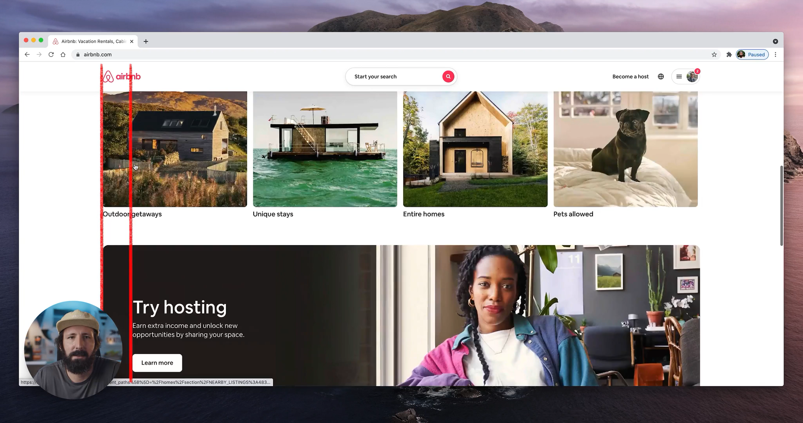

#### How To Pack A 1-2-Maybe 3

又是一节看标题不知其意的课，简单来说，访客打开网站首页时，屏幕展现的板块数量一般在 1~3，目的是保持简洁，下面直接截几张图片感受一下

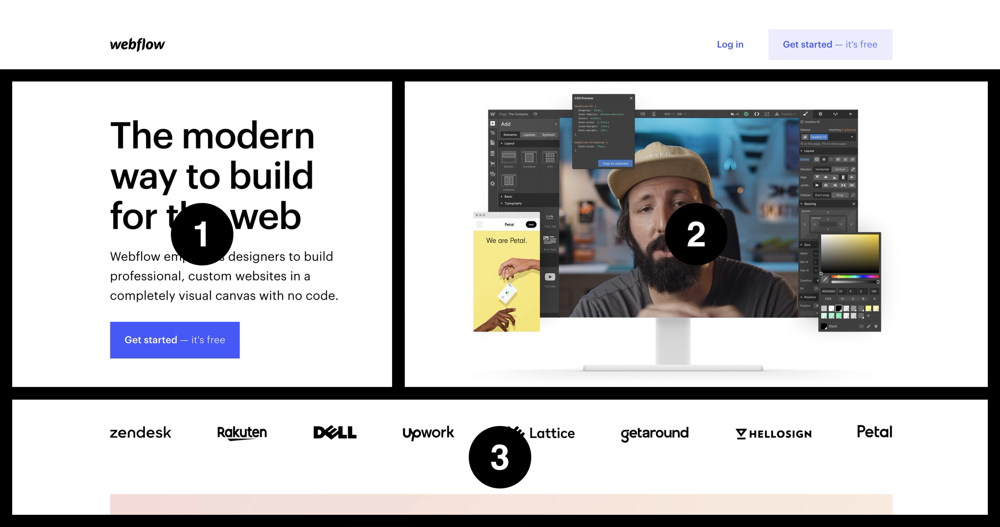
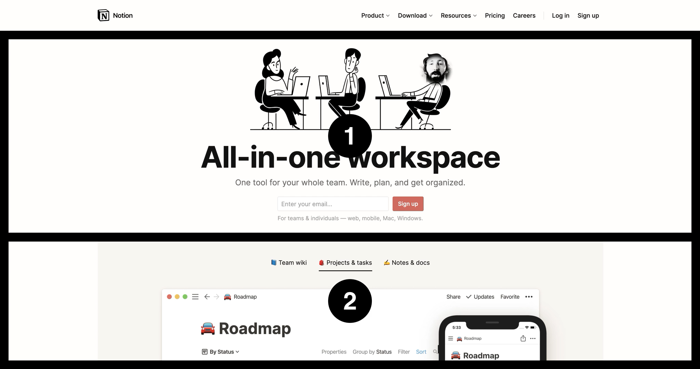
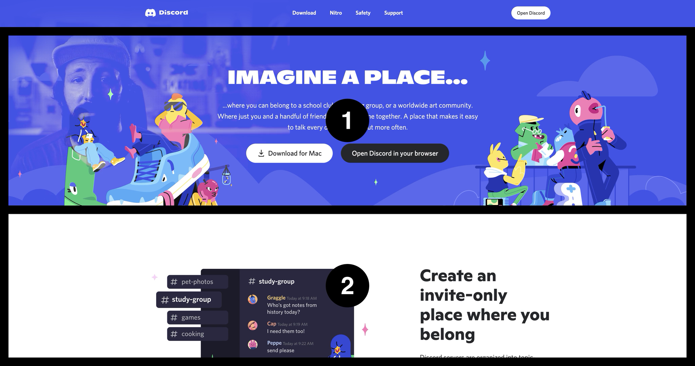

#### End with An Action

在结尾处加上一个 CTA，用处仿佛是一个销售给你展示完整个页面，故事也讲完了，接下来干点什么事情一样，结尾处的 CTA 也可以看作是一个总结引导。

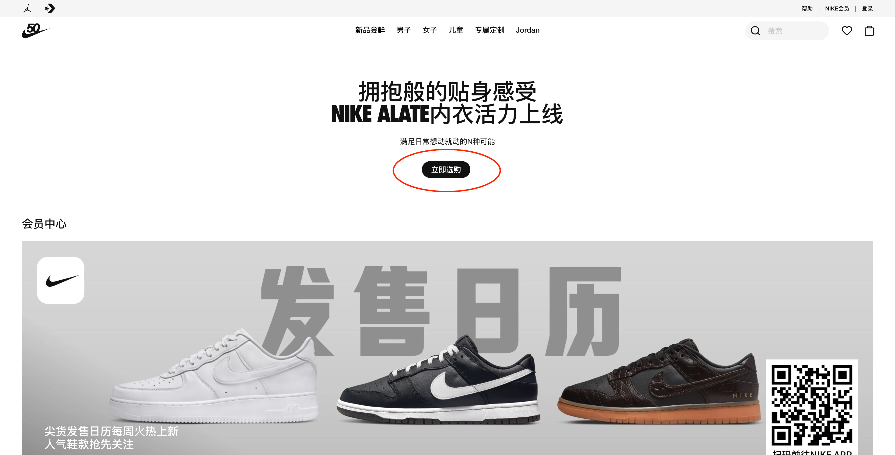
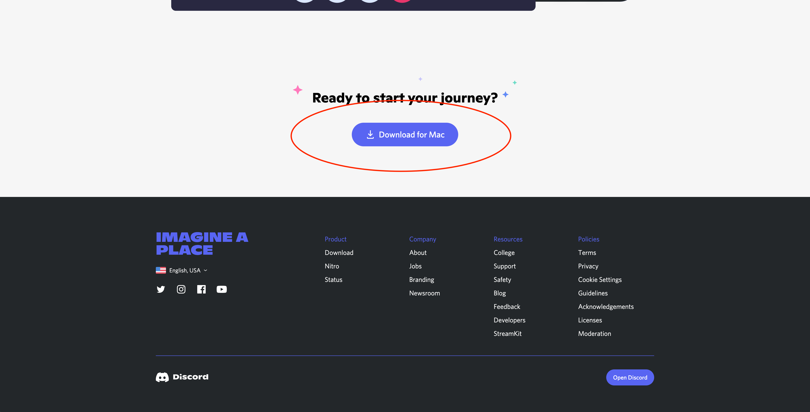

#### Consistent in Every View

网页元素的风格保持一致，通过例子可以解释

简单的一个例子就是按钮不应该一个地方用圆角，一个地方用直角 👇

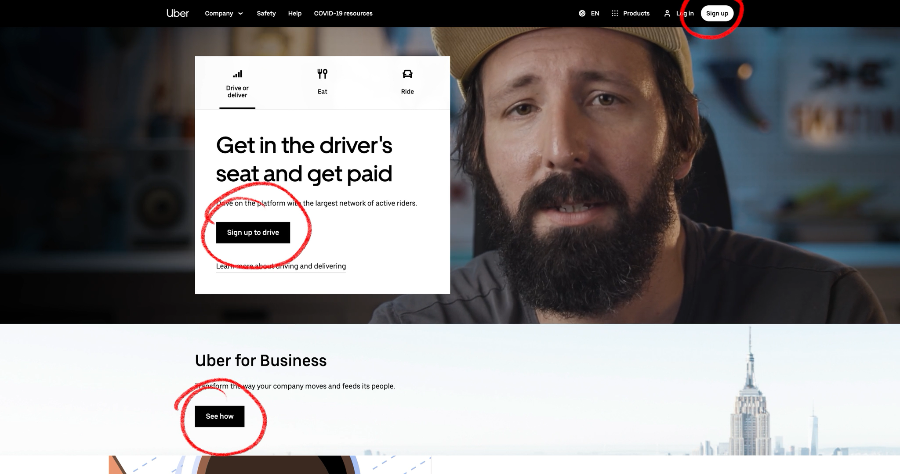

相同 CTA 的文案应保持一致 👇

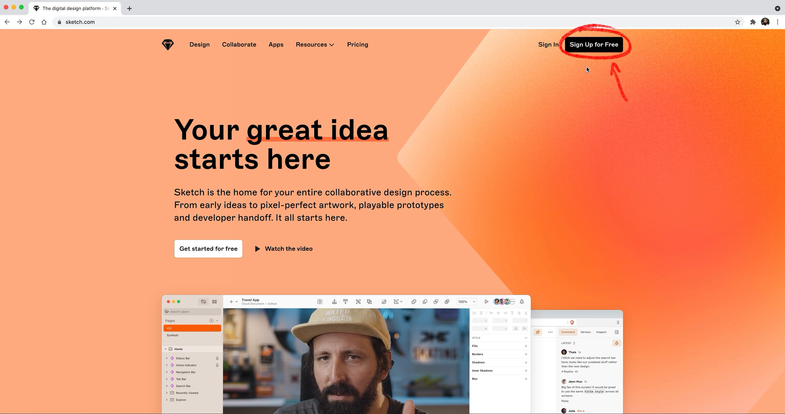

功能相同或者类似的 CTA 配色应保持一致 👇

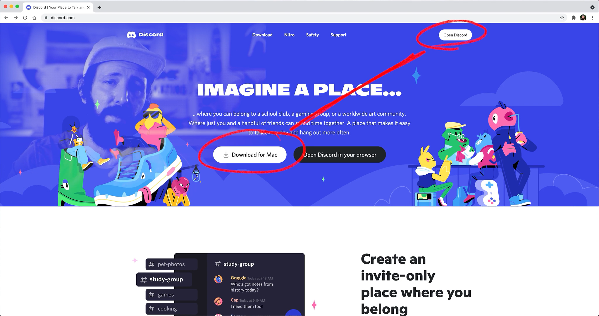

小组件在各个功能相同的页面中应该同时存在 👇

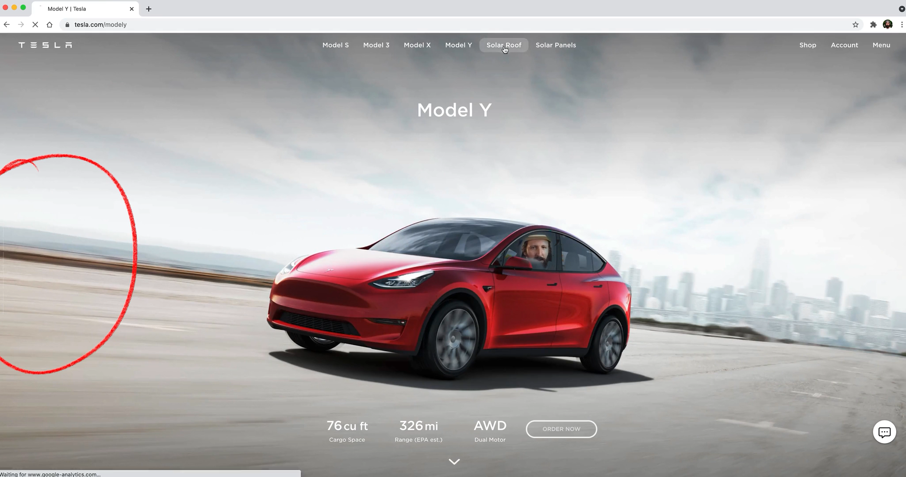

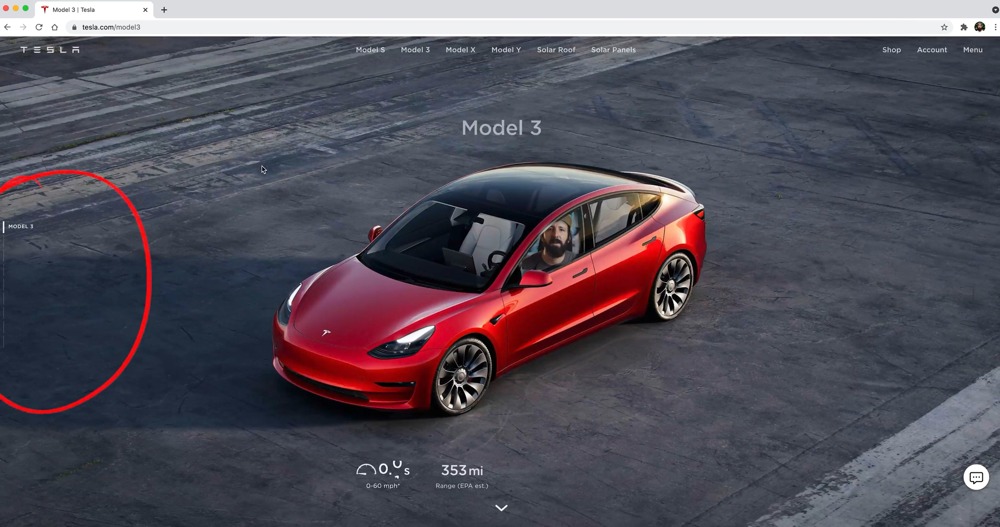

#### Typography Musts

最后一个建议是文字的排版要避免一个单词占据一整行，这节有 20 多分钟，核心内容都是前面那一句

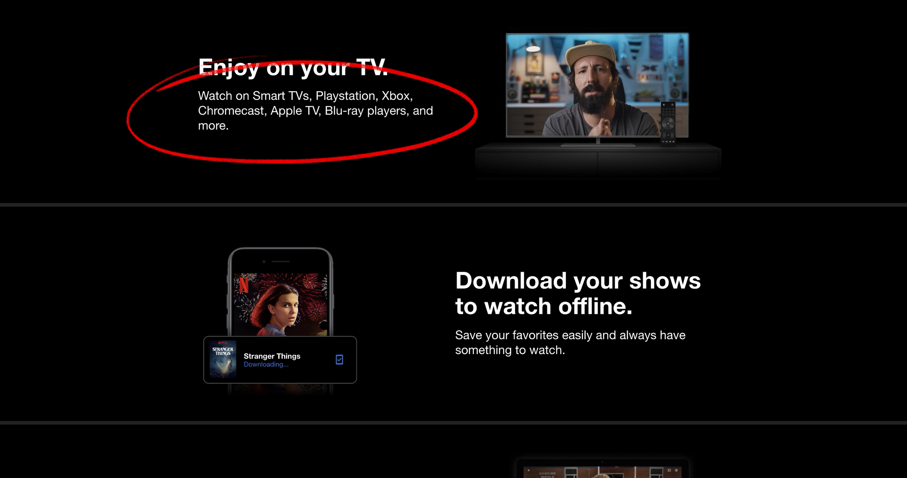

#### 总结

有了上面八个小建议，在浏览和设计品牌网站首页的时候，脑海里多了一些评判的标准，当然，这不是教科书式的，设计本来就可以天马行空没有约束地进行创造。
