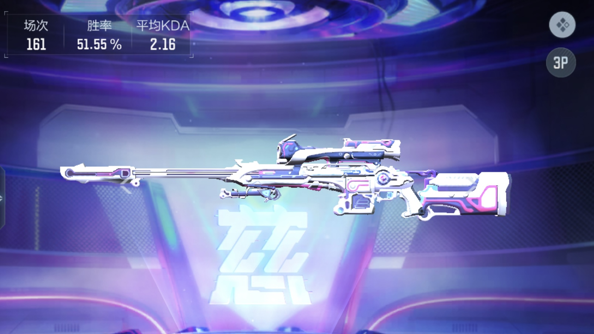

看着几个只写了梗概的草稿文件许久，我选择先写 2024 的年度总结，也包含一些 2023 年的。

#### 车

一年前拥有了自己的第一部车，国产燃油 SUV，不讨论油电之争，根据自己的用车需求，参考了一下销量榜，做点功课，跟销售 Battle Battle，就入手了。估计我是同龄人中开车比较晚的了，前些年基本在外漂泊，用车场景不多。市内打的基本都能解决，跨省市出行就比较痛苦点得搭动车，节假日时候还得抢票，前几年春节期间给黄牛增加过创收。

有了代步车自然方便很多，但是刚开始上手开车的心里总会有些许恐惧，毕竟从拿证到上手也隔了两年多，买车前也只选择了试乘没有试驾。开车从手生到熟悉的过程是比较值得记录的，特别是这一年开的 6000 km 中犯过的一些新手错误，以下简单记录一下。

- **急刹**，红绿灯路口，行驶过程遇到前方绿灯闪烁，犹豫而急刹，没有追尾，车内人员体验不佳
- **超齐头车**，城市道路四车道，十字路口，我在左二，绿灯亮起步后，开到一个斑马线左一车减速停车，我还继续行驶，差点撞了一条狗。
- **没有让速让道**，城市道路四车道，我在右二，行驶过程中，路边的一台车偏偏等车来的时候起步进入我的车道，本能往左变道，致使左手车辆减速，未发生事故。
- **变道没观察后方来车**，高速路三车道，我在左一，接近出口匝道时才看到导航提示右转，没仔细观察后方来车就打右灯变道，后方车辆鸣笛加速通过，未发生事故。
- **窄车位**，地下停车场，立体铁架车位，车位宽度较小，停进去后偏离一点车位线会一直报警，重新入库后车轮上方发生轻微剐蹭 🌚
- **险闯红灯**，夜间郊区道路，70 km/h 的速度路过一个红灯，没有任何人和车辆，发现红灯时急刹

前三个错误，平时经常看一些车祸集锦及分析，道理都懂，但实际操作起来还需要一些经验。目前行驶过的道路环境不是很多，城市道路，县道，乡道，高速，比较难忘的一次是白天高速上遇到大暴雨，摸索了一下才知道本车打开雾灯的前提是开近光灯。

未来还有很多不同的道路要走。

#### 域名续费

24 年年初的时候，本站域名快到期，这是我第一次犹豫要不要续费。这几年不仅是写博客的欲望减少，另一方面来看，生活过得也没那么丰富多彩，以致于要是问起去年五一或者十一假期做了些什么事情，我回答不上来，可能还会和多年前的事情混淆。全靠手机里随手记录的相册回忆，不然就真的什么也记不起。归根结底个人认为是没有认真生活，对伴侣承诺的仪式感也没有，这方面我自知是比较欠缺的，自知但又不做就说不过去了，24 年大热的《再见爱人 4》里反映出的婚姻问题里也包含这个。执行力是个好东西，相信拥有它后会将是我的生活的一个分水岭。

说回域名，最后在过期的前几天续上了，后面没有折腾过。以前想着给博客换个主题样式或者用 Next.js 重构还有点动力，现在以浏览为主，没有任何输出，跟只在朋友圈点点赞的行为类似。

**这不是我想要的**

#### TAC-慈

这是一把 CF 手游里的狙击枪道具，游戏里获得途径是游戏币兑换，游戏币获得的途径是

- 做每日任务，免费
- 用已有游戏币参加赛事竞猜，拿倍率，其实就是押注

兑换这个道具所需的游戏币，**做每日任务**需要肝大半年。

以上是背景。

得知有第二种竞猜方式获取游戏币后，用小段时间玩法，一个晚上的时间就得到了足够兑换这个道具的币。

这件事情让我觉得大量资本在市场中，打工能稳定，但买不了保时捷(不是说我要买 🌚)。没有推崇走偏门方式获取资本，而是到头来还得是要拥有自己小生意，发现市场上某个领域的痛点问题，提供价值解决它，并且传播。总结来说是**构建**和**营销**，好的产品用户会自主传播。

说起工作，也提一下近期的状态，全职在前端领域上，管理后台、小程序、app、数据可视化都有，React 是主力，Vue 有些项目扔过来维护也用到，可以说是大杂烩混着来。期间在 Apple Store 和 Goolge Play 上架过公司维护的项目 app，虽然所用的技术是 uni-app 这种一锅熟的，但算是比较新鲜的体验。

编程工具上新加入了 **NeoVim**，社区配置是[AstroNvim](https://astronvim.com/)，原因是公司电脑配置略低，需要一个轻量级的方案。该配置功能丰富，开箱即用，配合上 [lazygit](https://github.com/jesseduffield/lazygit) 等内置的操作流，使用过程感到舒适。比较缺乏的是 AI 工具的引入，还没 NeoVim 中折腾过，想用 AI 相关功能时都是直接切到 VSCode 和 WindSurf。

说到开箱即用，很多领域有类似的实现，比如[Omakub](https://omakub.org/)，程序员 DHH 出品，这是一个 Ubuntu 系统的工具配置集合，看着很好玩，也仅限于看看视频别人玩玩。其他的还有 **shipXXXfast** 之类的 Saas 工具，[ShipMobileFast](https://shipmobilefast.com/) 用来开发 App，[ShipFast](https://shipfa.st/) 用来开发网页应用。

App 技术储备方面有待加强，重温前几年我对 React Native 和 Flutter 的看法，有一些改变，现在觉得前者比较香。

#### 亲人与健康

两年间，家族里有 5 位长辈与世长辞，感受的变化是由开始的惊讶、难以接受，到后来逐渐习惯，以至于一接到家里的电话或者看到亲人群里有大量未读消息，就潜意识觉得有不妙的事情发生。时常觉得目前父母尚在是件美好的事情，但忧患意识也偶尔让我模拟过他们不在的日子。看过一篇丁香医生的[文章](https://dxy.com/article/196905)，三个断崖式晒老可能的节点，34 岁，60 岁，78 岁，不知不觉家人和自己已经都到了这些年龄，健康依然是最注重的话题。

虽然这些年的年度总结的最后寄语都是祝愿身体健康，但也没深度了解过如何才能健康。自己的腰和颈椎都出现了问题，手麻和脚麻的现象都有。去医院做过磁共振，接受过医生的治疗建议，过程十分敷衍，三个疗程感觉被棍了一千块。个人愚见最主要是平时保持好体态，加强肌肉训练。工作中用上了腰靠，家里办公桌换成了升降桌，椅子换成西昊的 C100 人体工程学椅，目前仅有缓解。运动方面还是有些缺乏，不想当文具多的差生。

新的一年，身体已经开始动起来。

二五年，祝大家身体健康，幸福美满。
