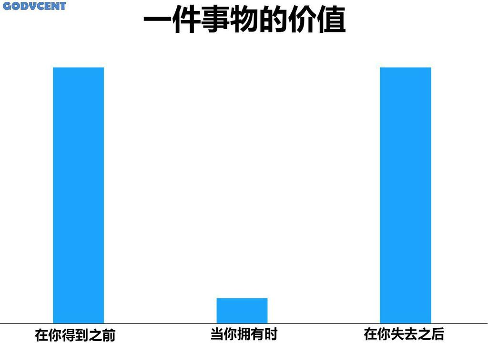

2025.03.09 这天，**lattespirit.com** 域名到期，不再续费。

最直接的原因是没有优惠券，非常直接。网络上没找到合适的，而且要在付款页进行多次试错。提前将续费订单放到购物车，GoDaddy 官方也没有通过邮件方式发优惠码促销，索性随缘。

根本原因是该域名给我带来的精神价值已经越来越少，使用 GitHub 提供的二级域名也不赖。

还别说，决定不续费后，在博客上的生产力提升了不少

- 把 Gatsby 版本从 v3 升级到 v5，可以说是换血
- 构建及发布方式改成了 GitHub Action
- 优化了部分手机端文章容器宽度过小问题
- 文章 slug 也全部整理一遍，把中文缩写换成英文
- 修复 RSS 图片失效问题
- 把域名及解析工作迁移到 GitHub Pages

怎么感觉我像在把近期的提交记录在这里抄了一次。

上图来自收藏的表情包，之所以收藏是第一次看到时有笑到，然后觉得有道理，如今用在不续费域名这件事情上很应景。

#### 复盘

拥有的东西常常不会去珍惜，失去后才会怀念。

要看到且珍惜现在拥有的，失去时不会有太多悔恨。

#### 博客未来

如今博客唯一需要付费的项目已经去掉了，真正的完全免费，希望能继续保持热情。

博客 UI 方面要改的内容还有很多，发现自己这么多年来对 animation 的兴趣不减，争取给博客加上丝滑的动效，跟上潮流。
